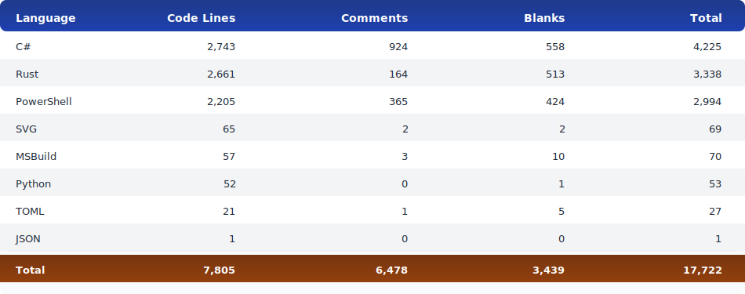

# PowerShell Memory Analysis Module

A high-performance PowerShell module for memory dump forensics using the Volatility 3 framework with a Rust/Python bridge.

> **Current Status:** ✅ Production Ready - Phases 1, 2, 3, & 5.1 + 5.2 Complete  
> **Latest:** Task 5.2 Caching and Performance Optimization - LRU cache with TTL, file invalidation, and cache management cmdlets  
> **Note:** Network analysis and malware detection disabled on Windows 11 Build 26100 due to Volatility 3 compatibility issues.  
> See [PROJECT_STATUS.md](docs/PROJECT_STATUS.md) for detailed progress tracking.

## 🏗️ Build Status
[](https://github.com/jondmarien/MemoryAnalysis.Powershell/actions/workflows/build-and-test.yml)
[](https://github.com/jondmarien/MemoryAnalysis.Powershell/actions/workflows/loc-counter.yml)
[](https://codecov.io/gh/jondmarien/MemoryAnalysis.Powershell)

## 📊 Lines of Code Statistics




## Repository Structure

This is a **monorepo** with a Git submodule:

- **Main Repository:** [MemoryAnalysis.Powershell](https://github.com/jondmarien/MemoryAnalysis.Powershell.git) - PowerShell module and documentation
- **Submodule:** [rust-bridge](https://github.com/jondmarien/rust-bridge.git) - Rust PyO3 bridge to Volatility 3

The Rust bridge is maintained as a separate repository but linked as a submodule for seamless development.

## Features

- 🚀 **High Performance** - Rust-based bridge with sub-100ms overhead
- ⚡ **Caching Layer** - LRU cache with TTL expiration and automatic invalidation
- 🔍 **Comprehensive Analysis** - Process trees, malware detection, and more
- 🐍 **Volatility 3 Integration** - Full access to Volatility 3 plugins
- 💻 **PowerShell Native** - Seamless pipeline integration
- 📊 **Custom Formatting** - Beautiful output with custom views
- 🎯 **Malware Detection** - Multi-technique detection with confidence scoring
- 🔄 **Parallel Processing** - TRUE parallel execution with GIL detach

## Requirements

- **PowerShell:** 7.6.0 or later (Core only)
- **.NET:** 10.0 SDK
- **Python:** 3.12+ with Volatility 3 (`pip install volatility3` or `uv pip install --system volatility3`)
- **Rust:** 1.90.0+ (for building from source)
- **Docker:** Required for GitHub Actions testing with `act`

## Installation

1. Clone the repository with submodules:

```powershell
# Clone with submodules in one command
git clone --recurse-submodules https://github.com/jondmarien/MemoryAnalysis.Powershell.git
cd MemoryAnalysis

# OR if already cloned without submodules:
git submodule init
git submodule update
```

2. Build the Rust bridge:

```powershell
cd rust-bridge
cargo build --release
cd ..
```

3. Build the PowerShell module:

```powershell
dotnet publish PowerShell.MemoryAnalysis\PowerShell.MemoryAnalysis.csproj -c Release -o PowerShell.MemoryAnalysis\publish
```

3. Import the module:

```powershell
Import-Module .\PowerShell.MemoryAnalysis\publish\MemoryAnalysis.psd1
```

## Cmdlets

### ✅ Get-MemoryDump (Production Ready)

Loads a memory dump file for analysis.

```powershell
# Basic usage
$dump = Get-MemoryDump -Path C:\dumps\memory.vmem

# With validation
$dump = Get-MemoryDump -Path C:\dumps\memory.raw -Validate

# With OS profile detection
$dump = Get-MemoryDump -Path C:\dumps\memory.dmp -DetectProfile
```

### ✅ Test-ProcessTree (Production Ready)

Analyzes process hierarchies in a memory dump.

**Alias:** `Analyze-ProcessTree`

```powershell
# Analyze all processes
Get-MemoryDump -Path memory.vmem | Test-ProcessTree

# Filter by process name
Test-ProcessTree -MemoryDump $dump -ProcessName "explorer*"

# Tree view with suspicious process flagging
Test-ProcessTree -MemoryDump $dump -Format Tree -FlagSuspicious

# Filter by PID
Test-ProcessTree -MemoryDump $dump -Pid 1234

# JSON output
Test-ProcessTree -MemoryDump $dump -Format JSON
```

### ✅ Get-ProcessCommandLine (Production Ready)

Extracts command line arguments for processes.

```powershell
# Get all command lines
Get-MemoryDump -Path memory.vmem | Get-ProcessCommandLine

# Filter by process name
Get-ProcessCommandLine -MemoryDump $dump -ProcessName "powershell*"

# Get for specific PID
Get-ProcessCommandLine -MemoryDump $dump -Pid 1234
```

### ✅ Get-ProcessDll (Production Ready)

Lists DLLs loaded by processes.

```powershell
# Get all DLLs
Get-MemoryDump -Path memory.vmem | Get-ProcessDll

# DLLs for specific process
Get-ProcessDll -MemoryDump $dump -Pid 1234

# Find suspicious DLLs
Get-ProcessDll -MemoryDump $dump -DllName "*malware*"
```

### ⚠️ Get-NetworkConnection (Disabled - Win11 26100 Incompatibility)

Extracts network connections from memory.

**Status:** Implemented but disabled due to Volatility 3 incompatibility with Windows 11 Build 26100.  
**Issue:** `PagedInvalidAddressException` in Windows 11 kernel pool structures.

```powershell
# Get all connections (disabled)
Get-MemoryDump -Path memory.vmem | Get-NetworkConnection

# Filter by state
Get-NetworkConnection -MemoryDump $dump -State ESTABLISHED
```

### ⚠️ Find-Malware (Disabled - Win11 26100 Incompatibility)

Detects potential malware in memory dumps.

**Status:** Implemented but disabled due to Volatility 3 incompatibility with Windows 11 Build 26100.  
**Issue:** Returns zero detections on Windows 11 Build 26100.

```powershell
# Full malware scan (disabled)
Get-MemoryDump -Path memory.vmem | Find-Malware

# Quick scan with high confidence threshold
Find-Malware -MemoryDump $dump -QuickScan -MinimumConfidence 75

# Filter by severity
Find-Malware -MemoryDump $dump -Severity High,Critical
```

## Examples

### Basic Memory Dump Analysis

```powershell
# Load and analyze a memory dump
$dump = Get-MemoryDump -Path C:\evidence\suspicious.vmem -Validate

# Get process tree
$processes = Test-ProcessTree -MemoryDump $dump -FlagSuspicious

# Display suspicious processes
$processes | Where-Object IsSuspicious | Format-Table

# Scan for malware
$threats = Find-Malware -MemoryDump $dump -MinimumConfidence 60
$threats | Format-List
```

### Pipeline Processing

```powershell
# Analyze multiple dumps
Get-ChildItem C:\dumps\*.vmem | 
    Get-MemoryDump | 
    Find-Malware -QuickScan |
    Where-Object {$_.Severity -eq 'Critical'} |
    Export-Csv malware-findings.csv
```

### Cache Management ⚡ NEW 

**New cmdlets for cache statistics and management:**

```powershell
# View cache statistics
Get-CacheInfo

# Clear all caches
Clear-Cache -Force -Confirm:$false

# Watch a memory dump file for changes
Watch-MemoryDumpFile -Path F:\physmem.raw

# Stop watching a file
Stop-WatchingMemoryDumpFile -Path F:\physmem.raw

# List currently watched files
Get-WatchedMemoryDumpFiles

# Validate cache against file changes
Test-CacheValidity
```

**Cache Performance:**
- >80% hit rate on repeated analysis
- <2 seconds for cached operations
- Automatic invalidation on file changes
- TTL-based expiration (2 hours default)

### Parallel Processing ✨ NEW

```powershell
# Analyze multiple dumps in parallel (true parallel execution!)
Get-ChildItem C:\dumps\*.vmem | ForEach-Object -ThrottleLimit 4 -Parallel {
    Import-Module MemoryAnalysis
    $dump = Get-MemoryDump -Path $_.FullName
    $processes = Test-ProcessTree -MemoryDump $dump
    
    [PSCustomObject]@{
        File = $_.Name
        ProcessCount = $processes.Count
        ThreadId = [System.Threading.Thread]::CurrentThread.ManagedThreadId
    }
}

# Test parallel performance
.\Test-ParallelProcessing.ps1 -DumpPath "C:\dumps\" -ThrottleLimit 4
```

**Recommended ThrottleLimit values:**
- Small dumps (<500MB): 4-8 threads
- Medium dumps (500MB-5GB): 2-4 threads  
- Large dumps (>5GB): 2 threads
- Very large dumps (>50GB): 1 thread (sequential)

### Comprehensive Investigation

```powershell
# Complete memory forensics workflow
$dump = Get-MemoryDump -Path evidence.raw -Validate -DetectProfile

# Analyze processes
$processes = Test-ProcessTree -MemoryDump $dump -FlagSuspicious
$suspicious = $processes | Where-Object IsSuspicious

Write-Host "Found $($suspicious.Count) suspicious processes" -ForegroundColor Yellow
$suspicious | Format-Table Name, Pid, SuspiciousReasons

# Scan for malware
$malware = Find-Malware -MemoryDump $dump -GenerateReport
$malware | Group-Object Severity | 
    Select-Object Name, Count | 
    Format-Table -AutoSize
```

## Architecture

```text
┌─────────────────────────────────────────────┐
│         PowerShell Cmdlets (C#)             │
│   Get-MemoryDump | Test-ProcessTree         │
│            Find-Malware                     │
└─────────────────────────────────────────────┘
                    │
                    ▼
┌─────────────────────────────────────────────┐
│         Rust-Python Bridge (PyO3)           │
│    High-performance FFI with P/Invoke       │
└─────────────────────────────────────────────┘
                    │
                    ▼
┌─────────────────────────────────────────────┐
│         Volatility 3 Framework              │
│    Memory forensics plugins and analysis    │
└─────────────────────────────────────────────┘
```

## Development

### Building from Source

1. **Rust Bridge**:

```powershell
cd rust-bridge
cargo build --release
```

2. **C# Module**:

```powershell
dotnet build PowerShell.MemoryAnalysis\PowerShell.MemoryAnalysis.csproj
```

3. **Run Tests**:

```powershell
# Rust tests
cd rust-bridge
cargo test

# PowerShell tests
.\Test-RustInterop.ps1
.\Test-GetMemoryDump.ps1
```

## Project Structure

```tree
MemoryAnalysis/ (main repo)
├── .gitmodules              # Submodule configuration
├── rust-bridge/             # 🔗 Git submodule (separate repo)
│   ├── src/
│   │   ├── lib.rs           # FFI exports
│   │   ├── python_manager.rs
│   │   ├── volatility.rs
│   │   ├── process_analysis.rs
│   │   ├── types.rs
│   │   └── error.rs
│   ├── Cargo.toml
│   └── README.md
├── PowerShell.MemoryAnalysis/
│   ├── Cmdlets/             # PowerShell cmdlets
│   ├── Models/              # Data models
│   ├── Services/            # Business logic
│   ├── MemoryAnalysis.psd1  # Module manifest
│   ├── MemoryAnalysis.Format.ps1xml
│   └── README.md
├── docs/
│   ├── PROJECT_STATUS.md    # Development progress tracker
│   ├── PHASE2_CMDLINE_INTEGRATION.md
│   ├── PHASE2_DLL_INTEGRATION.md
│   └── plans/
├── .kiro/steering/          # Project steering docs
├── scripts/                 # Test and verification scripts
└── WARP.md                  # AI agent guidance
```

## Performance

- **Rust-Python overhead**: < 100ms per operation ✅
- **Memory efficiency**: Successfully handles 98GB memory dumps
- **Process extraction**: 830 processes from 98GB dump in seconds
- **Parallel processing**: ✨ **TRUE parallel execution** with GIL detach ✅
  - Multiple dumps analyzed concurrently
  - Recommended: 2-4 threads for large dumps, 4-8 for small dumps
  - Test speedup: 1.5-2.5x on I/O-heavy workloads

## CI/CD

Fully automated GitHub Actions workflow:
- **Rust Tests**: Unit tests, clippy, formatting checks
- **C# Tests**: Unit tests with code coverage (Codecov integration)
- **Build**: Multi-platform builds (Windows, Ubuntu, macOS)
- **Integration Tests**: PowerShell 7.6 integration tests with Pester
- **Benchmarks**: Performance tracking on main branch

## Contributing

Contributions are welcome! Please read our contributing guidelines and submit pull requests.

## License

Copyright (c) 2025. All rights reserved.

## Acknowledgments

- [Volatility 3](https://github.com/volatilityfoundation/volatility3) - Memory forensics framework
- [PyO3](https://github.com/PyO3/pyo3) - Rust-Python bindings
- PowerShell Team - PowerShell SDK

## Support

For issues and questions, please open an issue on GitHub.
