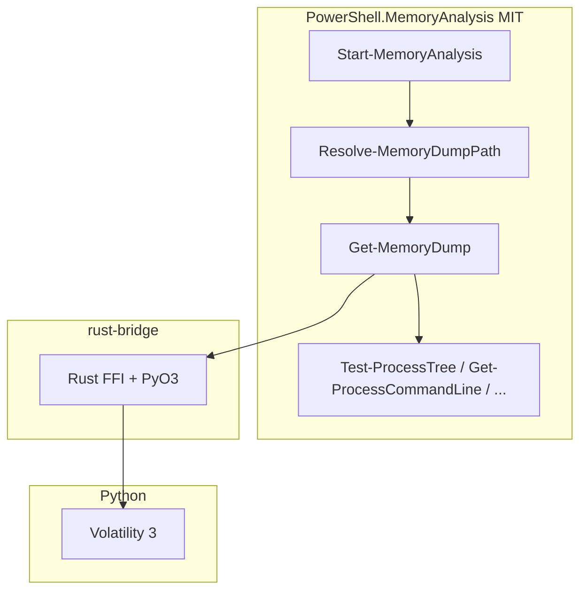

# MemoryAnalysis.Powershell — Architecture

## Overview

The project is a **monorepo** that connects PowerShell cmdlets (C# / .NET) to Volatility 3 through a **Rust PyO3 bridge**. On Windows, optional **live memory acquisition** is delegated to the **Collect-MemoryDump** submodule (GPL-3.0 script; not linked into the DLL).

## Repository layout

```text
MemoryAnalysis.Powershell/          MIT — main module
├── PowerShell.MemoryAnalysis/      C# cmdlets, services, models
├── rust-bridge/                    Submodule — PyO3 → Volatility 3
├── third-party/
│   └── Collect-MemoryDump/         Submodule — WinPMEM acquisition script (GPL-3.0)
├── docs/                           Plans, help markdown, requirements
├── tests/
│   ├── MemoryAnalysis.Tests/       xUnit (discovery, locators, services)
│   └── integration-tests/          Pester (module load, discovery, help)
└── scripts/                        Build, help generation
```

Clone with submodules:

```bash
git clone --recurse-submodules https://github.com/jondmarien/MemoryAnalysis.Powershell.git
```

## Analysis pipeline



## Memory dump discovery

`MemoryDumpDiscoveryService` performs a **breadth-first** file scan from a search root:

| Setting | Default | Meaning |
|---------|---------|---------|
| `MaxSearchDepth` | `1` | Current directory + one level of subdirectories |
| Extensions | `.raw`, `.vmem`, `.mem`, `.img`, `.aff`, `.bin`, `.lime`, `.dmp` | Candidate memory images |
| Minidump filter | `.dmp` &lt; 100 MB | Excluded (WER minidumps, not full RAM) |

`Resolve-MemoryDumpPath` merges:

1. User `-SearchPath` scan (depth from `-MaxSearchDepth`)
2. Collect-MemoryDump output tree under the submodule (depth ≥ 3 after acquisition)

## Acquisition (Windows only)

| Component | Role |
|-----------|------|
| `CollectMemoryDumpLocator` | Finds `Collect-MemoryDump.ps1` by walking up from module path to repo root |
| `CollectMemoryDumpRunner` | Invokes `pwsh -File ... -WinPMEM` (no compile-time GPL link) |
| `Invoke-MemoryDumpAcquisition` | Explicit acquisition entry point |
| `Resolve-MemoryDumpPath` | Prompts for acquisition when zero dumps and not `-NoAcquire` |

**Requirements:** Administrator, WinPMEM binary under `third-party/Collect-MemoryDump/Tools/WinPMEM/` (not redistributed).

**CI:** GitHub Actions sets `GITHUB_ACTIONS=true`; discovery cmdlets **must not** run live acquisition in CI. Tests use `-NoAcquire`; the module throws if acquisition would be prompted in CI.

## Licensing boundary

| Artifact | License | Integration |
|----------|---------|-------------|
| C# module, docs, scripts (except submodules) | MIT | Shipped as `PowerShell.MemoryAnalysis.dll` |
| `rust-bridge` | (submodule license) | Native library loaded by module |
| `Collect-MemoryDump` | GPL-3.0 | External script invocation only |
| WinPMEM / other tools | Vendor terms | User-supplied under `Tools/` |

See [THIRD_PARTY_NOTICES.md](../THIRD_PARTY_NOTICES.md) and [collect-memorydump-integration-plan.md](plans/collect-memorydump-integration-plan.md).

## Build and publish

1. `cargo build --release` in `rust-bridge/`
2. `dotnet publish PowerShell.MemoryAnalysis/... -o PowerShell.MemoryAnalysis/publish`
3. Copy `rust_bridge` native artifact into `publish/`
4. `Import-Module ./PowerShell.MemoryAnalysis/publish/MemoryAnalysis.psd1`

Published layouts may not include `third-party/` unless copied; discovery from a **dev clone** or paths that include the submodule is the supported acquisition layout.
