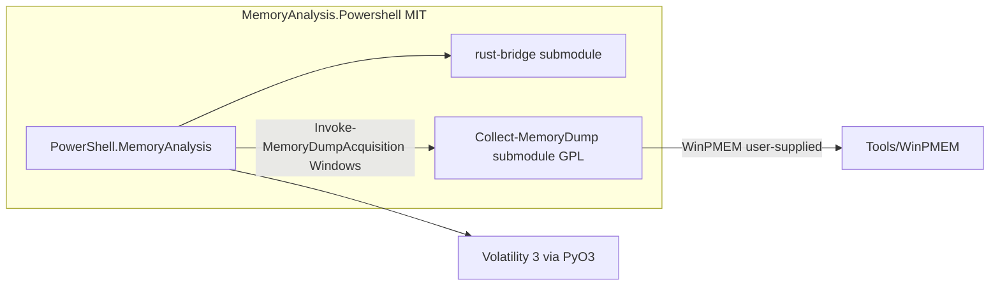

# Collect-MemoryDump Integration Plan

**Status:** Phases 0–4 complete; Phase 5 manual validation pending  
**Branch:** `cursor/collect-memorydump-integration-d23a`  
**Last updated:** 2026-05-29

## Decisions (locked)

| Topic | Decision |
|--------|----------|
| Entry points | **New cmdlets**; `Get-MemoryDump -Path` stays **mandatory** for backward compatibility |
| Acquisition fork | [jondmarien/Collect-MemoryDump](https://github.com/jondmarien/Collect-MemoryDump) |
| Monorepo layout | **Git submodule** at `third-party/Collect-MemoryDump` (same pattern as `rust-bridge`) |
| Default acquisition tool | **WinPMEM** (v1) |
| Bundled memory tools | **Not included** — user supplies binaries under submodule `Tools/` per upstream docs |
| Main repo license | **MIT** (see `LICENSE`) — personal/educational DFIR learning project |
| GPL acquisition script | Remains **GPL-3.0** in submodule; see `THIRD_PARTY_NOTICES.md` |
| **Search scope** | **Default `MaxSearchDepth = 1`** (cwd + one subdirectory level); override with `-MaxSearchDepth` (0–32) |

## Search scope (locked)

- **Default:** current directory + **one** subdirectory level (`MaxSearchDepth = 1`).
- **Override:** `-MaxSearchDepth` on `Resolve-MemoryDumpPath` and `Start-MemoryAnalysis` (e.g. `0` = cwd only, `3` = deeper case trees).
- **After acquisition:** also searches under `third-party/Collect-MemoryDump/` output folders (hostname/timestamp paths) with depth ≥ 3.
- **Minidump filter:** `.dmp` files under 100MB excluded (see `DUMP_REQUIREMENTS.md`).

## Monorepo architecture

```text
MemoryAnalysis.Powershell/          (MIT — this repo)
├── rust-bridge/                    (submodule → jondmarien/rust-bridge)
├── third-party/
│   └── Collect-MemoryDump/         (submodule → jondmarien/Collect-MemoryDump, GPL-3.0)
├── PowerShell.MemoryAnalysis/      (C# cmdlets + analysis)
├── docs/
└── tests/
```



### Clone / CI

```bash
git clone --recurse-submodules https://github.com/jondmarien/MemoryAnalysis.Powershell.git
# or after clone:
git submodule update --init --recursive
```

CI must use `submodules: recursive` (already used for `rust-bridge`).

## Licensing model

- **Your original work** (C# module, Rust bridge if you own it, docs, scripts): **MIT** — fits a personal learning project; allows others to study and reuse with attribution.
- **Collect-MemoryDump** (submodule): **GPL-3.0** — do not merge its source into the C# DLL; invoke as external script; keep LICENSE file in submodule path.
- **Volatility 3**: VSL — Python dependency, not vendored in repo.
- **WinPMEM / Magnet / etc.**: Third-party binaries — not redistributed by this project.

See root `LICENSE` and `THIRD_PARTY_NOTICES.md`.

## User flow (target)

1. User runs `Start-MemoryAnalysis` or `Resolve-MemoryDumpPath` (no path).
2. **Discovery** scans cwd + one subdirectory level for dump extensions.
3. **0 files** → prompt: offer WinPMEM acquisition via forked script (Windows + admin only).
4. **1 file** → use it (confirm if large/ambiguous).
5. **N files** → numbered prompt.
6. Resolved path → existing `Get-MemoryDump -Path` → analysis cmdlets.

Non-Windows: discovery + prompt only; acquisition message explains Windows requirement.

## New cmdlets (v1)

| Cmdlet | Role |
|--------|------|
| `Resolve-MemoryDumpPath` | Discovery + interactive resolution; no Volatility load |
| `Invoke-MemoryDumpAcquisition` | Calls `third-party/Collect-MemoryDump/Collect-MemoryDump.ps1 -WinPMEM` (+ fork flags) |
| `Start-MemoryAnalysis` | Optional orchestrator: resolve → `Get-MemoryDump` → hint next step |

## Fork / submodule maintenance

Patches live on [jondmarien/Collect-MemoryDump](https://github.com/jondmarien/Collect-MemoryDump):

1. PS **7.7** compatibility
2. `-OutputDirectory` / predictable output for discovery
3. `-NonInteractive` for automation/CI (skip UI where possible)
4. Optional JSON manifest after capture

Bump submodule pointer on main repo when fork releases tags.

## Implementation phases

### Phase 0 — Monorepo & legal ✅

- [x] Submodule `third-party/Collect-MemoryDump`
- [x] Root `LICENSE` (MIT)
- [x] `THIRD_PARTY_NOTICES.md`
- [x] This plan + README/AGENTS submodule docs

### Phase 1 — Discovery ✅

- [x] `MemoryDumpDiscoveryService` + unit tests
- [x] `Resolve-MemoryDumpPath` cmdlet (`-MaxSearchDepth`, `-NoAcquire`, `-Force`)
- [x] Pester: 0/1/N discovery scenarios (`Resolve-MemoryDumpPath.Tests.ps1`; multi-file prompt remains manual)

### Phase 2 — Acquisition wrapper ✅

- [x] `Invoke-MemoryDumpAcquisition` (Windows, WinPMEM default)
- [x] WinPMEM path validation under submodule `Tools/`
- [x] `CollectMemoryDumpRunner` + post-capture discovery

### Phase 3 — Orchestration ✅

- [x] `Start-MemoryAnalysis` (resolve → `Get-MemoryDump`)
- [x] `-NoAcquire`, `-SearchPath`, `-MaxSearchDepth` (default 1)
- [x] platyPS markdown help (`docs/help/Resolve-MemoryDumpPath.md`, etc.)

### Phase 4 — Docs & CI ✅

- [x] Update `DUMP_REQUIREMENTS.md`, `docs/architecture.md`
- [x] CI: recursive submodule (existing); `GITHUB_ACTIONS` blocks acquisition prompts; Pester uses `-NoAcquire`

### Phase 5 — Manual validation

- [ ] Windows VM: no dump → WinPMEM → `Analyze-ProcessTree`

## Risks

| Risk | Mitigation |
|------|------------|
| GPL compliance | Submodule + notices; script invocation only |
| Missing WinPMEM in Tools/ | Clear error + link to fork README |
| Elevation required | Document `Run as Administrator` |
| Collect-MemoryDump UI blocks CI | `-NonInteractive` in fork; skip acquisition in CI |

## Out of scope (v1)

- Bundling DumpIt/Magnet/commercial tools
- Live acquisition in GitHub Actions
- Making `Get-MemoryDump -Path` optional (breaking change)
